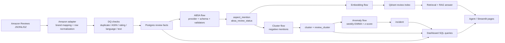

# VoiceLens 五层代码主线导读

> 这份文档按当前仓库中的真实代码整理，目标不是重复架构设计文档，而是回答三个更贴代码的问题：
>
> 1. VoiceLens 的代码主线是怎么串起来的。
> 2. 每一层的关键文件、类、函数分别在做什么。
> 3. 这些实现背后用了哪些数据工程、NLP、检索、机器学习和应用开发知识点。

---

## 0. 先看全局

VoiceLens 当前可以按五层代码主线理解：

1. **采集与数据质量层**：把 Amazon 评论转成可信的结构化 review 事实。
2. **ABSA 层**：把 review 文本转成 aspect、sentiment、severity、evidence quote。
3. **索引与检索层**：把 ABSA 处理后的 review 写入 Qdrant，并支持 dense、BM25、hybrid search。
4. **分析层**：对负面 aspect mention 做 issue clustering，再对时间序列做 anomaly detection。
5. **RAG、Agent 与 UI 层**：把检索、聚合统计、异常事件包装成可问答、可展示的产品界面。

### 0.1 一条完整数据流



### 0.2 先掌握的公共代码

五层代码都会依赖下面几个公共模块。

| 文件 | 作用 |
|---|---|
| `voicelens/config.py` | 读取 `.env`，集中定义数据库、Qdrant、数据路径、品牌 allowlist、DQ 阈值和 embedding 配置。 |
| `voicelens/db/engine.py` | 定义 SQLAlchemy `Base`、engine factory 和 `get_session()` 上下文管理器。 |
| `voicelens/db/models.py` | 定义 Postgres 表对应的 ORM 模型，是全项目的结构化数据合同。 |
| `Makefile` | 给每条主线提供可运行入口，例如 `ingest-mvp-subset`、`absa-llm-1k`、`embed-v2-1k`、`cluster-v2`、`anomaly-v2`、`dashboard`。 |

### 0.3 数据库模型先读什么

`voicelens/db/models.py` 是理解项目的第一站。它把项目中的数据事实拆成几组表。

| 模型 | 代码含义 | 业务含义 |
|---|---|---|
| `Brand` | 品牌表 | Anker、Bose、JBL 等品牌维度。 |
| `Sku` | SKU/ASIN 表 | 某个品牌下的具体商品。 |
| `Review` | 评论事实表 | 清洗后可分析的评论主表。 |
| `IngestRun` | 采集批次表 | 一次 ingest flow 的运行记录。 |
| `DQEvent` | DQ 事件表 | 每次 ingest 中每个质量检查的失败数量和示例。 |
| `AspectOntology` | aspect 词表 | 当前 ontology 版本中允许抽取哪些 aspect。 |
| `AspectMention` | aspect mention 表 | 一条 review 中被识别出的一个 aspect 事实。 |
| `ABSAReviewStatus` | review 级 ABSA 状态表 | 某条 review 是否已经被某个 provider/model/version 处理过。 |
| `Cluster` | issue cluster 表 | 一组相似负面投诉形成的主题簇。 |
| `ReviewCluster` | cluster membership 表 | 哪条 review 属于哪个 cluster。 |
| `Incident` | 异常事件表 | 某个 cluster 或 aspect 在某周异常升高。 |

这里最重要的设计点是：项目没有把所有内容混在一个 JSON 表里，而是把 **原始评论事实**、**模型抽取事实**、**处理状态**、**分析结果** 分层存储。这样做有几个知识点：

- **事实表与状态表分离**：`AspectMention` 只存实际 mention，`ABSAReviewStatus` 负责记录是否已处理。
- **版本化**：`AspectOntology.version`、`AspectMention.aspect_version`、cluster/anomaly scope 中的 `provider`、`model_name` 能区分不同代处理结果。
- **幂等性基础**：表上的 unique constraint 让重跑 flow 时能避免重复插入。
- **ORM 建模**：SQLAlchemy `Mapped`、`mapped_column`、`ForeignKey`、`UniqueConstraint`、relationship 用来把数据库结构显式放进代码。

---

# 1. 采集与数据质量层

## 1.1 这一层解决什么问题

这一层的输入是原始 Amazon Reviews 文件。原始数据的问题包括：

- 文件可能是 `.jsonl` 或 `.jsonl.gz`。
- review 文件本身不一定直接给出干净品牌名。
- 时间戳、rating、verified flag 可能有不同格式。
- 文本可能太短、垃圾、重复、缺 ASIN、rating 不合法。
- 下游 ABSA、检索、聚类都不应该直接消费脏数据。

所以这一层的职责不是“把文件读进来”这么简单，而是把原始行变成满足项目 schema 和质量门槛的 `Review` 行。

## 1.2 主要文件

| 文件 | 作用 |
|---|---|
| `voicelens/ingest/amazon_reviews_2023.py` | Amazon Reviews 2023 的 adapter，把原始行变成项目统一 review row。 |
| `voicelens/ingest/brand_scan.py` | 从 metadata 扫描候选品牌，帮助构建品牌 allowlist。 |
| `voicelens/ingest/brand_review_scan.py` | 把 review 与 metadata 的 brand map 对齐，统计各品牌评论量。 |
| `voicelens/pipeline/tasks/dq.py` | DQ 检查，负责接收 normalized row 并筛出 valid rows。 |
| `voicelens/pipeline/tasks/normalize.py` | 文本清洗、品牌/SKU get-or-create、review 入库。 |
| `voicelens/pipeline/flows/ingest_flow.py` | 合成样例数据的基础 ingest flow。 |
| `voicelens/pipeline/flows/amazon_ingest_flow.py` | 真实 Amazon 数据的 ingest flow。 |

## 1.3 `amazon_reviews_2023.py` 在做什么

这个文件是 Amazon 数据源 adapter。它的设计重点是：**把第三方数据格式隔离在 ingest adapter 内部**，不要让后续 DQ、Postgres load、ABSA 直接依赖原始 Amazon 字段名。

### 1.3.1 `_open_text()` 和 `_stream_jsonl()`

```python
def _open_text(path: Path):
    ...

def _stream_jsonl(path: Path) -> Iterator[dict[str, Any]]:
    ...
```

它们处理两件事：

- 根据文件后缀选择普通文本打开还是 gzip 打开。
- 按行解析 JSON，而不是一次性把大文件全部读进内存。

知识点：

- **JSONL**：一行一个 JSON object，适合大数据逐行处理。
- **Streaming IO**：对几十 GB 文件避免全量加载。
- **容错解析**：坏 JSON 行只记录 warning 并跳过，不让整批任务直接崩掉。

### 1.3.2 `canonicalize_brand()`

```python
def canonicalize_brand(raw_brand: str | None, allowlist: tuple[str, ...]) -> str | None:
    ...
```

原始 metadata 里的品牌值可能是：

- `ANKER`
- `Anker Innovations`
- `anker direct`
- `Soundcore by Anker`

这个函数把脏品牌名映射到 allowlist 中的 canonical brand，例如统一映射成 `Anker` 或 `Soundcore`。

知识点：

- **Entity normalization**：把同一实体的多种写法归一。
- **Allowlist filtering**：MVP 只保留目标品牌，范围更可控。
- **Regex 边界匹配**：避免品牌字符串误匹配到其他单词内部。

### 1.3.3 `load_asin_brand_map()`

```python
def load_asin_brand_map(metadata_path: Path, allowlist: tuple[str, ...] | None = None) -> dict[str, str]:
    ...
```

review 文件不一定直接带可靠品牌信息，因此代码先扫 metadata，建立：

```text
ASIN or parent_asin -> canonical brand
```

后续 review row 只要能拿到 `asin` 或 `parent_asin`，就能找到品牌。

知识点：

- **Dimension lookup / mapping join**：先构建 metadata map，再消费事实数据。
- **Parent-child product id**：Amazon 有 `asin` 与 `parent_asin` 的关系，代码优先考虑父 ASIN 映射。
- **Source-specific enrichment**：在 adapter 层补充业务维度。

### 1.3.4 `_normalize_row()`

这是 adapter 的核心函数。它完成：

- 找到 `asin` 与 `parent_asin`。
- 解析品牌。
- 构造 `source_id`。
- coercion rating。
- 把 title 与 body 合成 `text_raw`。
- 统一时间格式。
- 输出项目内部 row shape。

输出后的 row 大致长这样：

```python
{
    "source": "amazon_reviews_2023",
    "source_id": "...",
    "asin": "...",
    "brand": "Anker",
    "rating": 4,
    "verified": True,
    "posted_at": "2024-01-01T00:00:00",
    "text_raw": "...",
    "language": "en",
    "lang_confidence": 0.95,
    "locale": "en-US",
}
```

知识点：

- **Schema normalization**：把源系统字段映射成内部统一 schema。
- **Type coercion**：把 int、float、bool、timestamp 等字段变成内部期望类型。
- **Defensive programming**：缺字段时回退、格式不对时给出 `None`，再让 DQ 决定是否丢弃。

### 1.3.5 `iter_amazon_reviews()`

```python
def iter_amazon_reviews(...):
    ...
```

这是外部真正调用的 generator。它：

- 确认数据文件存在。
- 逐行调用 `_normalize_row()`。
- 在 allowlist 存在时过滤无品牌 row。
- 按匹配后的 review 数量执行 `limit`。

为什么 `limit` 放在匹配后，而不是读文件第 N 行后停止？

因为这个项目关心的是“目标品牌实际 yield 了多少行”，不是“扫描了多少原始行”。如果前几万行里没有目标品牌，过早停止会让 sample 失真。

## 1.4 `dq.py` 在做什么

`voicelens/pipeline/tasks/dq.py` 是这一层最关键的质量门。

### 1.4.1 `DQOutcome`

```python
@dataclass
class DQOutcome:
    valid_rows: list[dict[str, Any]]
    rejected: dict[str, list[dict[str, Any]]]
    per_check_failed: Counter
    total_rows: int
```

它让 DQ 的输出不只是“过滤后的 list”，而是带：

- 有效行。
- 每种失败原因对应的 rejected rows。
- 每个 check 的失败计数。
- 总行数、通过数、失败数、pass rate。

知识点：

- **Structured result object**：把 task 输出做成明确 contract。
- **Data observability**：失败原因本身也是数据产品。

### 1.4.2 `_row_dedup_key()`

重复检查不是只看一个字段，而是把 source、asin、source_id、posted_at、text hash 拼成 dedup key。

知识点：

- **Idempotency vs deduplication**：
  - dedup 解决一个 batch 内重复 row。
  - DB unique constraint 解决重跑入库时重复插入。
- **Hash key**：用 SHA1 做稳定 fingerprint。

### 1.4.3 `_check_row()`

这个函数按固定顺序判断第一种失败原因：

1. ASIN 是否缺失。
2. rating 是否在 1 到 5。
3. language 是否允许。
4. language confidence 是否过阈值。
5. 文本是否太短。
6. 文本是否像垃圾文本。

知识点：

- **Quality gate**：下游只拿通过门槛的数据。
- **Reason code**：失败原因可统计、可展示。
- **Rule-based validation**：基础数据质量不需要 LLM 判断。

### 1.4.4 `run_dq()`

`run_dq()` 是 DQ task 的统一入口。它先处理 batch-level dedup，再处理 row-level checks，最后填充 `DQOutcome`。

它对后续代码的重要性是：

- `amazon_ingest_flow` 不再关心每个 check 的细节。
- dashboard 可以通过 `DQEvent` 展示失败分布。
- tests 可以针对每种失败原因独立断言。

## 1.5 `normalize.py` 在做什么

### 1.5.1 `clean_text()`

把多余 whitespace 折叠成单空格，保证入库后的文本更稳定。

知识点：

- **Normalization**：避免原始换行、重复空格给索引和展示制造噪音。

### 1.5.2 `get_or_create_brand()` 与 `get_or_create_sku()`

这两个函数实现维表写入：

- 有 brand 就复用。
- 没有就创建。
- SKU 用 `(brand_id, asin)` 确认唯一性。

知识点：

- **Dimension table**：品牌与 SKU 是评论事实的维度。
- **Get-or-create pattern**：避免 ingest 中重复创建维度实体。

### 1.5.3 `load_reviews()`

这个函数把 valid rows 写到 `Review`：

- 先确保 brand 和 sku 存在。
- 查询 `(source, source_id)` 是否已存在。
- 已存在则跳过。
- 不存在才写 review。

知识点：

- **Upsert-like idempotent write**：虽然这里不是直接数据库 `ON CONFLICT`，但逻辑目标是避免重跑重复写。
- **Fact table write**：一条 review 入库后成为后续 ABSA 的输入事实。

## 1.6 两个 ingest flow 的区别

### 1.6.1 `ingest_flow.py`

`ingest_flow.py` 用于项目自带 sample reviews。它的主线很短：

```text
read_jsonl -> run_dq -> open_ingest_run -> load_reviews -> write_dq_events -> close_ingest_run
```

关键函数：

| 函数 | 作用 |
|---|---|
| `read_jsonl()` | 读取本地样例 JSONL。 |
| `open_ingest_run()` | 新建采集批次记录。 |
| `write_dq_events()` | 为每个 DQ check 写一行 `DQEvent`。 |
| `close_ingest_run()` | 写入完成时间、加载行数、状态。 |
| `ingest_flow()` | Prefect flow 入口。 |

### 1.6.2 `amazon_ingest_flow.py`

真实数据 flow 在基础 flow 外多了：

- metadata brand map。
- brands file / CLI brands 覆盖。
- 输入文件行数统计。
- 输出 brand counts 和 top ASIN counts。

核心执行路径：

```text
resolve input path
resolve metadata path
load brand map
iter Amazon reviews
run DQ
load Review
persist DQEvent and IngestRun
return summary
```

知识点：

- **Prefect flow orchestration**：把 task 组织成可运行 pipeline。
- **CLI and config layering**：`.env` 默认值、CLI override、brands file 同时存在。
- **Run summary**：flow 输出不只是成功失败，还带统计结果，便于 smoke check 和自动化。

## 1.7 这一层的测试告诉你什么

建议先读：

- `voicelens/tests/test_amazon_adapter.py`
- `voicelens/tests/test_dq.py`
- `voicelens/tests/test_ingest_flow.py`
- `voicelens/tests/test_amazon_ingest_flow.py`
- `voicelens/tests/test_brand_scan.py`

这些测试覆盖：

- gzip 与普通 JSONL 解析。
- 品牌别名映射。
- metadata join。
- 每一种 DQ failure。
- ingest 幂等性。
- fixture flow 的实际落库结果。

---

# 2. ABSA 层

## 2.1 这一层解决什么问题

仅有 `Review` 表还不够。业务真正想问的是：

- 这条评论在抱怨什么方面？
- 是电池、充电、蓝牙、价格、配送，还是可靠性？
- 这个 aspect 的情绪是正向、中性还是负向？
- 负向问题严重度如何？
- 结论在原文里对应哪一句证据？

ABSA 层把自由文本 review 变成结构化的 `AspectMention`。

## 2.2 主要文件

| 文件 | 作用 |
|---|---|
| `voicelens/nlp/absa/schema.py` | 用 Pydantic 定义 ABSA 输出 contract 与 ontology 版本。 |
| `voicelens/nlp/absa/prompts.py` | 给真实 LLM provider 的系统提示和 ontology 提示。 |
| `voicelens/nlp/absa/providers.py` | Mock provider 与 OpenAI/Anthropic provider。 |
| `voicelens/nlp/absa/validators.py` | review-grounded validation。 |
| `voicelens/nlp/absa/extractor.py` | provider 调用与 validator 的桥接。 |
| `voicelens/pipeline/flows/absa_flow.py` | 从 Postgres 选 review、调用 provider、写 mention 和 status。 |
| `scripts/seed_aspect_ontology.py` | 把 ontology 写入数据库。 |

## 2.3 `schema.py` 定义了什么合同

### 2.3.1 Ontology 版本

代码中存在两个版本：

```python
ONTOLOGY_CODES_V1 = (
    "battery",
    "charging",
    "overheating",
    "sound_quality",
    "bluetooth",
    "delivery",
    "price",
)

ONTOLOGY_CODES_V2 = ONTOLOGY_CODES_V1 + ("reliability",)
```

当前 `LATEST_ONTOLOGY_VERSION` 是 `v2`。

知识点：

- **Closed ontology**：不是让 LLM 任意生成 aspect，而是只能输出项目批准的 code。
- **Schema evolution**：当业务 ontology 升级时，新旧版本要能共存。
- **Backfill awareness**：ontology 改了以后，历史 review 可能需要按新版本重新处理。

### 2.3.2 `AspectMentionOut`

这个 Pydantic model 定义单个 mention：

- `aspect_code`
- `sentiment`
- `severity`
- `evidence_quote`

它还定义了两个重要 invariant：

- `evidence_quote` 不能为空。
- `severity` 只在 negative sentiment 上出现；negative 又必须带 severity。

知识点：

- **Pydantic validation**：模型输出先经过 schema 约束。
- **Domain invariant**：负面问题才需要严重度，正向 mention 不应该伪造 severity。

### 2.3.3 `ABSAOutput`

顶层输出就是：

```python
class ABSAOutput(BaseModel):
    aspects: list[AspectMentionOut]
```

这让 provider、flow、tests 对输出 shape 有统一预期。

## 2.4 `providers.py` 在做什么

ABSA provider 层把“谁来抽取 aspect”做成可替换实现。

### 2.4.1 `ABSAProvider`

这是抽象基类，定义 provider contract。它让 flow 不需要知道当前用的是：

- mock rule engine。
- Anthropic。
- OpenAI。

知识点：

- **Provider abstraction**：把外部模型调用隔离到实现类里。
- **Dependency injection**：tests 可以注入 fake/mock provider。

### 2.4.2 `MockABSAProvider`

Mock provider 是确定性的规则实现。它会根据关键词规则抽取 aspect，并保证 evidence quote 是原文 substring。

它的价值不是追求模型效果，而是：

- 不花 API 钱。
- CI 可跑。
- flow、DB、validator、统计逻辑可被稳定测试。

知识点：

- **Offline test double**：AI 系统中要把“系统 wiring 测试”和“真实模型质量”分开。

### 2.4.3 `LLMABSAProvider`

真实 provider 负责：

- 构造 OpenAI/Anthropic HTTP 请求。
- 使用 prompt 和 JSON schema。
- 处理模型输出。
- 跟踪 token、latency、estimated cost。
- 对 transient error 或 malformed output 做 retry。

知识点：

- **Structured output**：让 LLM 返回受约束 JSON，而不是自由文本。
- **Retry policy**：网络错误与格式错误需要重试，但不能无限重试。
- **Cost observability**：批处理 LLM 任务必须知道调用成本。

## 2.5 `validators.py` 为什么还要验证一次

即使 provider 返回了 Pydantic 可解析的 JSON，项目还需要 review-grounded validation。

`validate_absa_output()` 做三类检查：

1. `aspect_code` 必须属于当前 ontology。
2. `evidence_quote` 必须是原 review 的 verbatim substring。
3. 同一 review 中同一个 aspect 只能保留一次。

知识点：

- **Schema validation 不等于 grounded validation**：
  - schema 能说明字段类型对不对。
  - grounded validation 才能说明 evidence 是否真的来自 review。
- **Hallucination guardrail for extraction**：抽取任务也可能幻觉证据。
- **Dedup within record**：避免同一 aspect 在一条 review 中重复记数。

## 2.6 `extractor.py` 的角色

这个文件把 provider 与 validator 连起来。flow 不直接写：

```text
provider.extract()
parse output
validate output
count raw aspect candidates
```

而是交给 extractor 统一完成。

知识点：

- **Separation of concerns**：flow 管 orchestration，extractor 管一次抽取事务。

## 2.7 `absa_flow.py` 是这一层的主干

### 2.7.1 Review 选择逻辑

`_select_review_ids()` 决定本次要处理哪些 review。

它支持：

- 按 `source` 选 review。
- 按 `limit` 控制 batch。
- 按 `review_ids_file` 精确处理 holdout 或指定列表。
- 默认跳过已经在 `ABSAReviewStatus` 中存在状态的 review。
- `--force` 时重新处理。

知识点：

- **Batch selection**：AI pipeline 要能选范围，不能每次全量跑。
- **Cost control**：已经花钱处理过的 review 不应无意间重复处理。
- **Evaluation workflow**：review id file 支持只跑标注集或 holdout。

### 2.7.2 为什么要有 `ABSAReviewStatus`

如果一条 review 经过 provider 后输出：

```json
{"aspects": []}
```

它不会在 `AspectMention` 表里留下任何行。没有 status 表，下一次 flow 会误以为它没处理过，重复调用 LLM。

所以：

- `AspectMention` 是分析事实。
- `ABSAReviewStatus` 是处理足迹。

状态包括：

| status | 含义 |
|---|---|
| `success` | 至少一个 valid mention 入库。 |
| `no_mentions` | provider 正常处理，但没有抽到 aspect。 |
| `invalid` | provider 有输出，但 valid mention 全部被 validator 拒绝。 |
| `failed` | provider 调用阶段失败。 |

这是项目里很值得讲的工程点。

### 2.7.3 Guardrail 逻辑

`_guardrail_reason()` 与 `_check_guardrails()` 控制：

- estimated cost 是否超过预算。
- invalid review rate 是否过高。
- fail rate 是否过高。
- 在样本太少时是否先不触发 rate guardrail。

知识点：

- **Budget gate**：真实 LLM 批任务必须能中止。
- **Rate guardrail**：当模型质量或服务稳定性恶化时不要继续批量污染数据。

### 2.7.4 `absa_flow()` 的执行过程

执行顺序可以概括为：

```text
resolve provider and retries
load ontology rows from DB
select review ids
optional force delete existing status and mentions
for each review:
    provider extraction
    validator filtering
    insert AspectMention rows
    write ABSAReviewStatus
    check cost/invalid/fail guardrails
return summary with counts and provider usage
```

summary 中的指标包括：

- input/processed reviews。
- reviews with mentions/no mentions/invalid/failed。
- mention counts。
- raw evidence verbatim rate。
- aspect/sentiment/severity distribution。
- token/cost/latency/provider usage。

知识点：

- **Observability by summary**：flow 不是黑盒调用，输出本次 batch 的可解释统计。

## 2.8 这一层的测试告诉你什么

建议读：

- `voicelens/tests/test_absa_validators.py`
- `voicelens/tests/test_absa_provider.py`
- `voicelens/tests/test_absa_flow.py`
- `voicelens/tests/test_absa_flow_review_ids_file.py`
- `voicelens/tests/test_ontology_v2.py`

这些测试重点验证：

- severity 与 sentiment 约束。
- evidence verbatim。
- ontology v1/v2 行为。
- no_mentions 仍然记录状态。
- rerun 幂等性。
- `--force` 行为。
- guardrail 停止行为。

---

# 3. 索引与检索层

## 3.1 这一层解决什么问题

ABSA 让 review 可聚合，但用户还会问：

- 找出关于“几周后停止工作”的原始评论。
- 只看某品牌、某 aspect、某 sentiment 的评论。
- 相同问题可能有同义表达，不能只靠精确关键词。
- 型号、品牌、ASIN 又需要精确词命中。

因此项目同时保留：

- **Dense retrieval**：向量语义召回。
- **Lexical retrieval**：BM25 精确词召回。
- **Hybrid retrieval**：融合两种结果。

## 3.2 主要文件

| 文件 | 作用 |
|---|---|
| `voicelens/retrieval/embeddings.py` | Embedding provider 抽象与 mock/local/OpenAI 实现。 |
| `voicelens/retrieval/qdrant_index.py` | point id、embedding text、payload、collection upsert。 |
| `voicelens/pipeline/flows/embed_flow.py` | 从 Postgres 取 ABSA 处理后的 review，写入 Qdrant。 |
| `voicelens/retrieval/filters.py` | 构造 Qdrant payload filter。 |
| `voicelens/retrieval/search.py` | Dense query path，统一输出 `SearchHit`。 |
| `voicelens/retrieval/lexical.py` | BM25 lexical retriever。 |
| `voicelens/retrieval/hybrid.py` | dense + lexical 融合。 |
| `voicelens/rag/retrieve.py` | 给 CLI、RAG、Agent 共用的 retrieval facade。 |

## 3.3 `embeddings.py` 的设计

### 3.3.1 `EmbeddingProvider`

它定义：

- provider name。
- vector dimension。
- `embed_batch()` contract。

为什么 `dimension` 是一等公民？

因为 Qdrant collection 的向量维度必须与 embedding model 一致。索引用 384 维，查询用 32 维，搜索会失败。

### 3.3.2 `MockEmbeddingProvider`

Mock provider 把字符串 hash 成可重复向量。

价值：

- tests 不需要下载模型。
- smoke indexing 可以在 CI 内跑。
- 同一输入得到同一向量，断言稳定。

### 3.3.3 `LocalEmbeddingProvider`

它懒加载 `sentence-transformers`：

- import retrieval package 时不立刻拉 torch。
- 真正 embed 时才加载模型。
- 默认模型是 `BAAI/bge-small-en-v1.5`。

知识点：

- **Lazy loading**：避免导入成本和可选依赖成本污染基础路径。
- **Normalized embeddings**：输出向量经过归一化，配合 cosine search。

### 3.3.4 `OpenAIEmbeddingProvider`

它保留远程 embedding 实现：

- 启动时缺 `OPENAI_API_KEY` 直接失败。
- 通过 `/v1/embeddings` 调用远程服务。

知识点：

- **Fail fast config validation**：配置错时早失败，不静默降级。

## 3.4 `qdrant_index.py` 写入了什么

### 3.4.1 `build_point_id()`

point id 使用：

```text
review_id | aspect_version | provider | model_name
```

做 UUIDv5。

意义：

- 同一代处理结果重跑时 upsert 到同一点。
- 不同 ontology/provider/model 结果可以共存。

知识点：

- **Deterministic identifier**。
- **Versioned index entry**。

### 3.4.2 `build_embedding_text()`

项目不是只 embed 原始 review，而是构造：

```text
Review: <text_raw>
Aspects: charging negative medium; reliability negative high
```

这样 embedding 中同时带：

- 原始语义。
- ABSA 结构提示。

知识点：

- **Document representation**：向量检索效果受被 embed 的文本形态影响。
- **Feature augmentation**：把结构化 aspect summary 加到索引文本中。

### 3.4.3 `build_payload()`

Qdrant payload 存了：

- review id、source id。
- brand、asin、rating、verified、posted_at。
- raw text。
- aspect version、provider、model、ABSA status。
- aspect codes、sentiments、severities、evidence quotes。

为什么 payload 很重要？

- Dense search 只返回语义近似度。
- Payload filter 才能实现“只看 negative bluetooth reviews”。
- RAG answer 与 UI 需要 raw text 和 evidence quote。

### 3.4.4 `ensure_collection()` 与 `upsert_points()`

`ensure_collection()`：

- collection 不存在就建。
- collection 已存在时检查 vector size。
- 维度不匹配就报错，不允许混写。

`upsert_points()`：

- 分批写入 Qdrant，避免大请求。

知识点：

- **Vector DB schema compatibility**。
- **Batch write**。

## 3.5 `embed_flow.py` 的执行过程

### 3.5.1 `_resolve_review_rows()`

这个函数先看 `ABSAReviewStatus`：

- 默认只 index `success` 与 `no_mentions`。
- `failed` 与 `invalid` 默认不进索引。

然后再分别查：

- review 元数据。
- aspect mentions。

知识点：

- **Downstream quality propagation**：上游 ABSA 失败的数据不应默认进入检索层。
- **Focused SQL queries**：状态、review、mention 分开取，避免笛卡尔放大。

### 3.5.2 `_build_points()`

它对 review 做 batch embedding，再和 payload 合成 Qdrant `PointStruct`。

### 3.5.3 `embed_flow()`

主流程：

```text
resolve embedder
select eligible ABSA-processed reviews
ensure Qdrant collection
embed texts in batches
upsert points
return selected/embedded/upserted summary
```

## 3.6 `filters.py` 与 `search.py`

### 3.6.1 `build_search_filter()`

这个函数把可选条件变成 Qdrant `Filter`：

- brand。
- asin。
- aspect。
- sentiment。
- rating range。
- aspect version。
- provider/model。
- ABSA status。

`aspect_codes`、`sentiments` 在 payload 中是 list，Qdrant 对 list 字段的 `MatchValue` 可以表达“任意元素匹配”。

知识点：

- **Metadata filtering in vector retrieval**。
- **Hybrid structured + unstructured retrieval**。

### 3.6.2 `retrieve()`

Dense search path：

1. 把 query embed 成 vector。
2. 对 Qdrant 调 `query_points()`。
3. 把返回结果统一封装成 `SearchHit`。

`SearchHit` 的好处是：

- CLI、RAG、UI 不依赖 Qdrant SDK 内部对象。
- lexical 与 hybrid 最终也能返回相同结构。

## 3.7 `lexical.py` 为什么存在

Dense search 对语义好，但对型号、ASIN、品牌专有词、精确故障短语可能不如 lexical retrieval。

`BM25LexicalRetriever` 做了几件事：

- 从 Qdrant scroll 出同一批 payload。
- 用和 dense index 相同的 `build_embedding_text()` 重建 corpus text。
- 用 `rank_bm25` 构建内存 BM25。
- query path 返回 lexical hits。

知识点：

- **BM25**：基于词项频率、逆文档频率和长度归一化的经典 lexical retrieval。
- **Corpus consistency**：dense 与 lexical 必须在同一 corpus 上比，eval 才有意义。
- **Post-filtering**：BM25 自身不懂 Qdrant filter，所以 lexical 结果再用 `filter_payloads()` 过滤。

## 3.8 `hybrid.py` 如何融合

`hybrid_search()` 先分别取 dense hits 与 lexical hits，再融合 ranking。

实现支持三种策略：

| fusion | 含义 |
|---|---|
| `rrf_equal` | 经典 reciprocal rank fusion，两个 ranker 等权。 |
| `rrf_weighted` | lexical/dense 带权融合。 |
| `lexical_first` | 先保留 lexical 顺序，再用 dense 补位。 |

知识点：

- **Reciprocal Rank Fusion**：不依赖不同检索器 score 的可比性，只融合 rank。
- **Ranker calibration**：当 dense 比 lexical 弱时，等权融合可能稀释强检索器。

## 3.9 `rag/retrieve.py` 是 retrieval facade

RAG、Agent、CLI 不直接拼：

```text
open Qdrant client
create embedder
create BM25
choose mode
build filter
```

而是统一调用 `retrieve_reviews()`。

这样做的好处：

- 查询路径只有一处定义。
- 测试可以注入 in-memory Qdrant client。
- Agent 不需要知道 Qdrant wiring 细节。

## 3.10 这一层的测试告诉你什么

建议读：

- `voicelens/tests/test_retrieval_qdrant_index.py`
- `voicelens/tests/test_retrieval_filters.py`
- `voicelens/tests/test_embed_flow.py`
- `voicelens/tests/test_evaluate_retrieval.py`
- `voicelens/tests/test_ui_retrieval.py`

这些测试覆盖：

- deterministic point id。
- payload 字段。
- vector dimension mismatch。
- index flow 幂等性。
- brand/aspect filters。
- dense、lexical、hybrid 三条路径。

---

# 4. 分析层

## 4.1 这一层解决什么问题

检索回答“给我找证据”，分析层回答：

- 负面评论主要形成了哪些 issue groups？
- 哪类 complaint 更严重？
- 某个问题是不是最近突然上升？

这一层把 `AspectMention` 进一步变成：

- `Cluster`：静态问题簇。
- `Incident`：时间维度上的异常事件。

## 4.2 主要文件

| 文件 | 作用 |
|---|---|
| `voicelens/analytics/labels.py` | 用关键词和 quote 生成短 cluster label。 |
| `voicelens/analytics/clustering.py` | 从负面 mentions 构建 records 并做 TF-IDF/KMeans 或 BERTopic。 |
| `voicelens/pipeline/flows/cluster_flow.py` | cluster 结果落库。 |
| `voicelens/analytics/anomaly.py` | 聚合 weekly buckets，计算 EWMA、std、z-score。 |
| `voicelens/pipeline/flows/anomaly_flow.py` | 从 cluster membership 构造事件并写 `Incident`。 |

## 4.3 `clustering.py` 做了什么

### 4.3.1 `ClusterRecord`

它把数据库 join 后的负面 mention 展平成适合 clustering 的 record：

- review id。
- brand、asin、rating。
- posted_at。
- aspect code。
- severity。
- evidence quote。
- raw review text。

`cluster_text` 优先用 evidence quote，quote 为空才退回 raw review text。

为什么优先 quote？

- quote 是 ABSA 抽出的局部投诉证据。
- 全评论文本可能包含 praise、背景、配送等噪音。

### 4.3.2 `build_clustering_records()`

它从数据库只选：

- 当前 `aspect_version/provider/model_name` scope。
- `ABSAReviewStatus.status == success`。
- `AspectMention.sentiment == negative`。

知识点：

- **Scope consistency**：聚类不混不同模型世代的数据。
- **Negative-only analytics**：issue clustering 关心抱怨，不把正向评价混进主题。

### 4.3.3 `cluster_records()`

这个函数先按 aspect 分组，再对每个 aspect 的 evidence quote 子聚类。

为什么先按 aspect 分组？

- `charging` 与 `bluetooth` 本来就是不同业务语义。
- 在 MVP 中先隔离 aspect，再找 aspect 内的 issue pattern，结果更可解释。

### 4.3.4 TF-IDF + KMeans 路径

默认实现 `_cluster_one_aspect_tfidf()`：

1. `TfidfVectorizer` 把 quote 转成词向量。
2. 根据样本量与 `min_cluster_size` 决定 k。
3. `KMeans` 做分簇。
4. 小于最小成员数的簇丢弃。
5. 取 top TF-IDF keywords。
6. 生成代表 review、representative quote 和短 label。

知识点：

- **TF-IDF**：词项在局部文本中的区分度。
- **KMeans**：划分式 clustering，依赖预设 k。
- **Minimum cluster size**：防止噪声簇被包装成“issue”。
- **Severity-weighted ranking**：高严重度投诉比轻微抱怨更值得靠前。

### 4.3.5 BERTopic 路径

如果安装了 `bertopic`，`algorithm="auto"` 可以选 BERTopic。当前仓库把它做成 optional heavy dependency。

知识点：

- **Optional dependency**：项目主干可跑，重依赖功能可选。
- **Baseline first**：TF-IDF/KMeans 是更轻、更稳定的 MVP baseline。

## 4.4 `cluster_flow.py` 如何落库

`persist_clusters()`：

- 先清掉同一 scope 下旧 cluster。
- 写 `Cluster`。
- 写每个成员的 `ReviewCluster`。
- 防止同一 review 在同一个 cluster 内重复 membership。

`cluster_flow()`：

```text
load negative cluster records
cluster per aspect
persist cluster and memberships
return counts by aspect and algorithm
```

知识点：

- **Replace-on-rerun semantics**：同一 scope 的 cluster 是一次重新计算结果，不是无限追加。
- **Membership table**：cluster 与 review 是多对多关系，需要 join 表。

## 4.5 `anomaly.py` 做了什么

### 4.5.1 `MentionEvent`

它是异常检测的 atomic event：

- 一个负面 clustered mention。
- 带 review id、cluster id、aspect、severity、event time、rating、quote。

### 4.5.2 `aggregate_weekly()`

它把 mention events 聚合成 weekly buckets：

- cluster granularity：每个 cluster 一条时间序列。
- aspect granularity：每个 aspect 一条时间序列。

每个 bucket 记录：

- observed volume。
- severity-weighted volume。
- unique review count。
- average rating。
- example quotes。

知识点：

- **Event time bucketing**：按 review `posted_at` 对齐到周。
- **Granularity selection**：cluster 粒度细但稀疏，aspect 粒度粗但更稳。

### 4.5.3 `ewma_baseline()` 与 `rolling_std()`

EWMA 只用当前周之前的历史 volume 计算 baseline。

这样做避免当前 spike 自己进入 baseline，冲淡异常程度。

知识点：

- **EWMA**：近期历史权重大，适合滚动 baseline。
- **Rolling standard deviation**：衡量历史波动。
- **Look-ahead leakage avoidance**：当前样本不能污染自己的 baseline。

### 4.5.4 `detect_anomalies()`

只有同时满足条件才变成 incident：

- 有足够历史周数。
- z-score 超阈值。
- observed volume 超最低门槛。
- severity-weighted volume 超最低门槛。

知识点：

- **Guardrail thresholding**：只有 z-score 高还不够，小样本 spike 可能是假信号。
- **Severity-aware incident scoring**：严重投诉更早应被看到。

### 4.5.5 `build_incident_summary()`

summary 不调用 LLM，而是 deterministic string：

- 说明 aspect。
- 说明 cluster/aspect 粒度。
- 说明 observed vs baseline。
- 说明 z-score。
- 附一个代表 quote。

知识点：

- **Deterministic narrative**：分析结果展示时不一定都要 LLM。

## 4.6 `anomaly_flow.py` 如何把 cluster 变 incident

主要步骤：

1. `build_mention_events()` 从 `review_cluster`、`cluster`、`review` join 出事件。
2. `_quote_map()` 单独取 evidence quote，避免 join 放大。
3. `aggregate_weekly()`。
4. `detect_anomalies()`。
5. 生成 summary。
6. 清掉旧 incidents。
7. `upsert_incident()` 写新 incident。

`upsert_incident()` 的 natural key 关注：

```text
aspect_version + provider + model_name + granularity + cluster_id + aspect_code + week_start
```

知识点：

- **Natural key**：同一个业务事件重写，不重复造事件。
- **Join explosion awareness**：quote lookup 单独查，避免一条 membership 被多 mention join 放大。

## 4.7 这一层的测试告诉你什么

建议读：

- `voicelens/tests/test_clustering.py`
- `voicelens/tests/test_cluster_flow.py`
- `voicelens/tests/test_anomaly.py`
- `voicelens/tests/test_anomaly_flow.py`

重点验证：

- cluster records 只包含 negative + success。
- cluster 最小规模约束。
- 聚类 rerun 幂等。
- EWMA baseline 排除当前周。
- min history/min volume/min severity 门槛。
- incident 入库与 natural key 幂等。

---

# 5. RAG、Agent 与 UI 层

## 5.1 这一层解决什么问题

前四层已经有了：

- review facts。
- aspect facts。
- searchable Qdrant index。
- clusters。
- incidents。

第五层把这些能力变成用户可以接触的产品面：

- 搜索 review。
- 从 retrieved reviews 生成带引用回答。
- 用自然语言问题路由到 retrieval、analytics 或 incidents。
- 用 dashboard 看分布、clusters、incidents 和 DQ。

## 5.2 主要文件

| 文件 | 作用 |
|---|---|
| `voicelens/rag/citations.py` | 把 retrieval hit 映射成引用对象。 |
| `voicelens/rag/prompts.py` | 回答生成 prompt 与 insufficient-evidence token。 |
| `voicelens/rag/providers.py` | Mock answer provider 与真实 LLM answer provider。 |
| `voicelens/rag/answer.py` | 生成回答并做 citation guardrail。 |
| `voicelens/agent/router.py` | 关键词路由与 filter extraction。 |
| `voicelens/agent/state.py` | Agent state 与 summary。 |
| `voicelens/agent/tools.py` | retrieval、incident、analytics、insufficient 四类 route node。 |
| `voicelens/agent/graph.py` | LangGraph 单次路由图。 |
| `voicelens/ui/db.py` | Dashboard 只读 SQL query helper。 |
| `voicelens/ui/app.py` | Streamlit navigation。 |
| `voicelens/ui/pages/*.py` | 各页面渲染逻辑。 |

## 5.3 RAG 引用链路

### 5.3.1 `citations.py`

`build_citations()` 把 `SearchHit` 变成 `Citation`：

- rank 变 citation id。
- 带 review id/source id。
- 带 brand、asin、rating。
- 带 aspect codes。
- 带 evidence quote 与 text snippet。
- 带 retrieval score。

知识点：

- **Evidence object**：回答层拿到的不是裸文本，而是可审计证据对象。
- **Stable citation numbering**：回答里的 `[1]`、`[2]` 对应 retrieved rank。

### 5.3.2 `providers.py`

回答 provider 和 ABSA provider 类似：

- `MockAnswerProvider` 用于离线测试和 demo。
- `LLMAnswerProvider` 支持 OpenAI/Anthropic。

Mock provider 不追求自然语言很漂亮，而是确保：

- relevant evidence 时返回引用。
- irrelevant evidence 时返回 insufficient evidence。

### 5.3.3 `answer.py`

`generate_answer()` 是 RAG answer orchestrator：

1. 构造 citations。
2. 没有 hits 时直接 short-circuit insufficient evidence。
3. 调 answer provider。
4. 如果 provider 返回 insufficient token，转成显式状态。
5. 扫描回答中的 citation markers。
6. 移除不在 retrieved citation set 中的 unsupported markers。
7. 返回 `AnswerResult`。

知识点：

- **Retrieve then answer**：回答严格基于检索结果。
- **Citation guardrail**：模型写了不存在的 `[99]` 也要剥掉。
- **Auditability**：`AnswerResult` 保留 retrieved ids、citations、guardrail flags、filters。

## 5.4 Agent 不是自治系统，而是单次路由图

### 5.4.1 `router.py`

`classify_route()` 按关键词优先级选 route：

1. incident。
2. analytics。
3. retrieval。
4. insufficient scope。

`extract_filters()` 从 question 中提取：

- aspect。
- sentiment。
- brand。

知识点：

- **Deterministic router**：透明、可测试、可复现。
- **Lightweight self-query**：当前不是 LLM self-query，而是规则提取 filter hints。

### 5.4.2 `tools.py`

四类 route node 分别做：

| Node | 做什么 |
|---|---|
| `retrieval_answer_node()` | 调 retrieval facade，再调 RAG answer。 |
| `incident_summary_node()` | 读 dashboard DB helper 中的 incident 结果，生成 top incidents 文本。 |
| `analytics_summary_node()` | 根据 question 读 aspect/sentiment/severity/status 分布。 |
| `insufficient_scope_node()` | 对域外问题返回安全拒答。 |

这里一个很实用的设计是 `AgentConfig.retrieve_fn` 可注入。测试时可以传 hand-built hits，不需要真实 Qdrant。

知识点：

- **Tool node**：不同数据路径做成独立 node。
- **Read-only agent**：当前所有工具都不写外部系统，降低风险。
- **Dependency injection for tests**。

### 5.4.3 `graph.py`

LangGraph 图的结构非常简单：

```text
START
  -> route_question
  -> exactly one of:
       retrieval_answer
       incident_summary
       analytics_summary
       insufficient_scope
  -> format_response
  -> END
```

它没有：

- memory。
- planning loop。
- multi-agent。
- autonomous actions。
- retry/replan cycle。

知识点：

- **StateGraph**：节点读取和更新 state。
- **Conditional edges**：路由结果决定下一个节点。
- **Scope honesty**：LangGraph 被用作受控 workflow，而不是为了包装成复杂 agent。

## 5.5 Dashboard 查询层

### 5.5.1 `ui/db.py`

这个文件很关键，因为它把 Streamlit 页面和 ORM 细节隔离开。

特点：

- 所有函数都是 read-only。
- 每次函数自己打开短 session。
- 返回 plain dict/list，而不是 ORM object。

主要查询函数：

| 函数 | 页面用途 |
|---|---|
| `get_overview_stats()` | Overview headline metrics。 |
| `get_reviews_by_brand()` | 品牌评论分布。 |
| `get_absa_status_distribution()` | ABSA status 分布。 |
| `get_aspect_distribution()` | aspect mention 分布。 |
| `get_sentiment_distribution()` | sentiment 分布。 |
| `get_aspect_sentiment_matrix()` | ABSA page 的 aspect x sentiment matrix。 |
| `get_severity_distribution()` | negative mentions 的 severity 分布。 |
| `get_negative_examples()` | 负面 evidence examples。 |
| `get_clusters()` | Issue Clusters page。 |
| `get_cluster_members()` | cluster drill-down。 |
| `get_incidents()` | Emerging Incidents page。 |
| `get_ingest_runs()` | DQ page 的 ingest runs。 |
| `get_dq_summary()` | DQ fail reasons。 |
| `get_pipeline_coverage()` | ABSA coverage/reliability。 |

知识点：

- **Query service layer**：页面不直接写 SQLAlchemy query。
- **Read model**：UI 读的是适合展示的数据 shape。
- **Aggregate query**：`count`、`group_by`、join、filter 是分析型 SQL 的基础。

### 5.5.2 `ui/app.py`

它负责 Streamlit navigation，把页面分成七个入口：

1. Overview。
2. ABSA Distribution。
3. Issue Clusters。
4. Emerging Incidents。
5. Retrieval Search。
6. Agent Q&A。
7. Data Quality。

### 5.5.3 `ui/pages/retrieval.py`

这个页面把检索能力产品化：

- 用户输入 query。
- 选 dense/lexical/hybrid。
- 设置 brand/aspect/sentiment/rating filters。
- 查看 raw search hits。
- 可选调用 beta answer generator。

它的 `run_search()` 与 `run_answer()` 保持 streamlit-free，便于单测。

### 5.5.4 `ui/pages/agent.py`

这个页面展示 agent workflow：

- 选 answer provider。
- 输入 question。
- 调 `run_agent()`。
- 展示 route、filters、answer、citations、warnings。

它的重要价值不是“聊天窗口”，而是把路由决策展示出来，证明系统不是把每个问题都塞给一个 LLM 黑盒。

## 5.6 这一层的测试告诉你什么

建议读：

- `voicelens/tests/test_rag_answer.py`
- `voicelens/tests/test_agent.py`
- `voicelens/tests/test_agent_eval.py`
- `voicelens/tests/test_ui_db.py`
- `voicelens/tests/test_ui_retrieval.py`

重点验证：

- unsupported citation markers 被剥掉。
- no evidence 时明确拒答。
- route classifier 行为。
- retrieval route 返回 citation。
- incident/analytics route 走 DB aggregate path。
- UI query helper 在空库上也不崩。

---

# 6. 五层之间的关键接口

## 6.1 从 ingest 到 ABSA

接口是 `Review` 表。

- ingest 层负责保证 review 基本合法。
- ABSA 层只从 Postgres 选择 review，不重新理解 Amazon 原始字段。

这体现：

- source adapter 与 NLP pipeline 解耦。
- 数据质量在上游统一治理。

## 6.2 从 ABSA 到检索

接口是：

- `ABSAReviewStatus`
- `AspectMention`
- `Review`

索引层只 index 默认可信状态，mention 作为 payload 与 embedding text 的结构增强。

## 6.3 从 ABSA 到分析

接口是 negative `AspectMention`。

- 聚类只拿 negative success mentions。
- anomaly 继续基于 cluster membership 做周聚合。

## 6.4 从检索与分析到产品层

RAG 读 Qdrant search hits。

Agent 同时能：

- 走 retrieval facade。
- 读 incidents。
- 读 aggregate stats。

Dashboard 通过 `ui/db.py` 展示 Postgres read model，通过 retrieval page 读 Qdrant。

---

# 7. 代码里最值得掌握的知识点清单

## 7.1 数据工程

- JSONL/GZ streaming。
- Source adapter。
- Data Quality checks。
- Dead-letter/reason code 思路。
- Dimension table 与 fact table。
- Run metadata。
- Batch flow summary。
- Idempotent write。
- Versioned processing scope。

## 7.2 Python 工程

- Dataclass result object。
- Pydantic schema。
- SQLAlchemy ORM。
- Context-managed DB session。
- ABC/provider abstraction。
- Lazy optional dependency。
- Dependency injection for tests。
- CLI arguments 与 config layering。

## 7.3 NLP 与 LLM extraction

- ABSA。
- Closed ontology。
- Structured output。
- Evidence quote grounding。
- Sentiment/severity contract。
- Retry 与 batch cost guardrail。

## 7.4 检索与 RAG

- Dense embedding。
- Vector DB collection 与 payload。
- Metadata filter。
- BM25 lexical search。
- Hybrid retrieval。
- Reciprocal Rank Fusion。
- Citation object。
- Unsupported citation guardrail。
- Insufficient evidence path。

## 7.5 机器学习分析

- TF-IDF。
- KMeans。
- Optional BERTopic。
- Cluster representative samples。
- Severity-weighted ranking。
- Weekly aggregation。
- EWMA baseline。
- Rolling std。
- z-score。
- Threshold guardrails。

## 7.6 应用层

- LangGraph `StateGraph`。
- Conditional routing。
- Read-only tool nodes。
- SQL aggregate helpers。
- Streamlit multi-page app。
- UI 与 query service 分离。

---

# 8. 推荐阅读顺序

如果你要真正读懂代码，建议按下面顺序读，不要一开始就在 UI 里跳。

1. `voicelens/config.py`
2. `voicelens/db/models.py`
3. `voicelens/pipeline/tasks/dq.py`
4. `voicelens/ingest/amazon_reviews_2023.py`
5. `voicelens/pipeline/flows/amazon_ingest_flow.py`
6. `voicelens/nlp/absa/schema.py`
7. `voicelens/nlp/absa/validators.py`
8. `voicelens/pipeline/flows/absa_flow.py`
9. `voicelens/retrieval/qdrant_index.py`
10. `voicelens/pipeline/flows/embed_flow.py`
11. `voicelens/retrieval/search.py`
12. `voicelens/retrieval/lexical.py`
13. `voicelens/retrieval/hybrid.py`
14. `voicelens/analytics/clustering.py`
15. `voicelens/pipeline/flows/cluster_flow.py`
16. `voicelens/analytics/anomaly.py`
17. `voicelens/pipeline/flows/anomaly_flow.py`
18. `voicelens/rag/answer.py`
19. `voicelens/agent/router.py`
20. `voicelens/agent/tools.py`
21. `voicelens/agent/graph.py`
22. `voicelens/ui/db.py`
23. `voicelens/ui/app.py`

---

# 9. 读完后你应该能回答的问题

## 9.1 对采集层

- 为什么 Amazon adapter 要先做 metadata brand mapping？
- DQ dedup 与 DB 幂等入库有什么区别？
- 为什么 DQ 结果要记录每个失败 reason？

## 9.2 对 ABSA 层

- 为什么 `AspectMention` 和 `ABSAReviewStatus` 要分表？
- 为什么 JSON schema 合法还不够，仍要验证 quote 是 verbatim substring？
- ontology v1 与 v2 的代码差异是什么？

## 9.3 对检索层

- 为什么索引文本里要拼 `Aspects:` summary？
- 为什么 payload filter 对 vector retrieval 很重要？
- dense、BM25、hybrid 各适合什么查询？

## 9.4 对分析层

- 为什么先按 aspect 分组再 cluster？
- 为什么 anomaly baseline 不能包含当前周？
- cluster granularity 与 aspect granularity 的 tradeoff 是什么？

## 9.5 对产品层

- 当前 Agent 为什么是受控路由，不是自治 agent？
- RAG answer 如何避免引用不存在的 review？
- Dashboard 为什么用 `ui/db.py` 做中间 query helper？

---

# 10. 当前实现边界

理解代码时要把“已实现”和“目标架构”分开。

当前代码已经实现：

- Amazon ingest adapter。
- DQ checks 与 DQ metrics。
- Postgres ORM schema。
- ABSA provider contract、validators、status tracking、batch guardrails。
- Qdrant indexing。
- Dense、BM25、hybrid retrieval。
- TF-IDF/KMeans clustering，BERTopic optional。
- EWMA anomaly detection。
- Citation-grounded answer generator。
- Deterministic LangGraph router workflow。
- Streamlit dashboard。

当前不要说成已经实现：

- 全量 245k review 的 ABSA 覆盖。
- 多语言 ingestion 与 translation-augmented embeddings。
- FastAPI production serving。
- Next.js UI。
- ClickHouse analytical store。
- Mem0 memory。
- critique/replan loop。
- autonomous write actions。
- reranker fine-tuning。

这也是这份代码导读的阅读原则：先用当前代码证明当前能力，再看 design 文档理解下一阶段演进。
