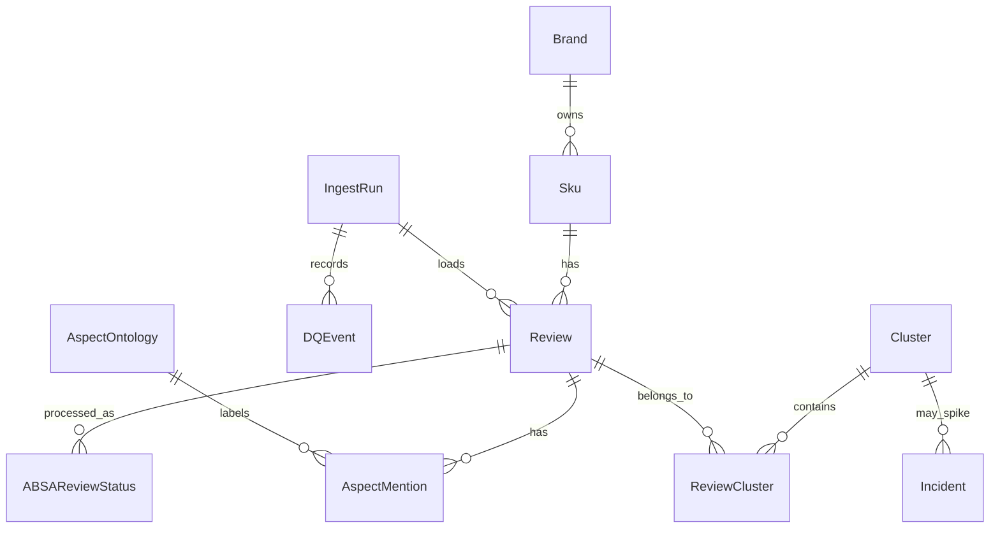

# VoiceLens 项目完全掌握手册

> 这份文档的目标不是再把函数逐个解释一遍，而是把你训练到能独立讲清、调试、扩展和评审 VoiceLens。
>
> 建议配套阅读：
>
> - `docs/VoiceLens_five_layer_code_walkthrough.md`：解释代码主线和函数职责。
> - `docs/VoiceLens_five_layer_data_simulation.md`：用一组数据模拟函数输入输出。
> - 本文：把项目变成可掌握的知识地图、训练路径和实战题。
>
> 如果本文和早期的 `docs/VoiceLens_knowledge_mastery_guide.md` 有冲突，以当前仓库代码、上述两份五层文档和本文为准。那个文件看起来来自更早阶段，里面有些“代码尚未实现”的判断已经不符合当前仓库。

---

# 0. 一句话掌握 VoiceLens

VoiceLens 是一个把电商评论从“自然语言文本”加工成“可治理事实、可检索证据、可聚合指标、可预警事件、可引用回答”的端到端 VoC 数据平台。

不要把它理解成一个简单的情感分析 demo。更准确的理解是：

```text
raw customer reviews
-> quality-controlled review facts
-> aspect-level sentiment facts
-> searchable review evidence
-> clustered complaint issues
-> weekly anomaly incidents
-> dashboard and citation-grounded answers
```

真正的主角不是 LLM，而是这些稳定的数据合同：

| 合同 | 位置 | 作用 |
|---|---|---|
| Review fact schema | `voicelens/db/models.py` | 规定一条评论进系统后怎么存。 |
| Aspect ontology | `AspectOntology` + `voicelens/nlp/absa/schema.py` | 规定允许抽取哪些 aspect。 |
| ABSA output schema | `AspectMentionOut`、`ABSAOutput` | 约束 LLM 或 mock provider 的输出。 |
| Qdrant payload | `voicelens/retrieval/qdrant_index.py` | 规定检索命中后能带回哪些过滤字段和证据字段。 |
| Cluster / Incident schema | `Cluster`、`ReviewCluster`、`Incident` | 规定负面问题和异常事件怎么落库。 |
| Agent state | `voicelens/agent/state.py` | 规定一次问答路由、检索、回答如何传状态。 |

只要这些合同稳定，provider、embedding model、clustering algorithm、UI 都可以替换。

---

# 1. 先建立 7 张脑内地图

## 1.1 业务地图：这个项目到底帮谁做什么

目标用户可以想象成三类人：

| 用户 | 关心的问题 | VoiceLens 给他的能力 |
|---|---|---|
| 产品经理 | 哪些功能点被用户抱怨最多？ | aspect sentiment、negative examples、RAG answer。 |
| 质量工程师 | 哪个 SKU 最近是否出现质量异常？ | issue clusters、weekly incidents、evidence quotes。 |
| 客户洞察分析师 | 用户在不同品牌、评分、时间上的声音如何变化？ | dashboard filters、ABSA distribution、retrieval search。 |

所以每一层代码都不是为了炫技，而是服务这些业务问题：

- DQ：不要把垃圾评论或重复评论当成真实信号。
- ABSA：不要只知道“负面”，要知道“负面在哪里”。
- Retrieval：回答问题时能找到原文证据。
- Clustering：把零散抱怨变成可命名的问题主题。
- Anomaly：发现最近突然上升的问题。
- UI / Agent：让非工程用户能查、能问、能追证据。

## 1.2 目录地图：每个目录一句话

| 目录 | 一句话理解 |
|---|---|
| `voicelens/db` | 全项目结构化事实的数据库合同。 |
| `voicelens/ingest` | 把外部 Amazon 数据格式转成内部 review row。 |
| `voicelens/pipeline/tasks` | 可复用的数据质量和入库任务。 |
| `voicelens/pipeline/flows` | Prefect 风格的端到端离线流程入口。 |
| `voicelens/nlp/absa` | aspect-based sentiment extraction 的 schema、provider、validator。 |
| `voicelens/retrieval` | embedding、Qdrant payload、dense / BM25 / hybrid search。 |
| `voicelens/analytics` | issue clustering 和 anomaly detection 的纯分析逻辑。 |
| `voicelens/rag` | 把 retrieval hits 变成带 citation 的答案。 |
| `voicelens/agent` | 一次性 LangGraph 路由：route -> one tool -> format。 |
| `voicelens/ui` | Streamlit dashboard 页面和数据库查询 helper。 |
| `voicelens/eval` | ABSA、retrieval、agent 的评测逻辑。 |
| `voicelens/tests` | 最好的学习入口之一：每个模块的行为规格。 |
| `scripts` | 可运行的运维、评测、导出、统计脚本。 |
| `ops` | Docker / demo / infra 相关入口。 |
| `design` | 架构设计和 MVP 边界说明。 |

## 1.3 数据地图：核心表之间怎么连



读 `models.py` 时要抓住三层事实：

1. 原始事实：`Brand`、`Sku`、`Review`、`IngestRun`、`DQEvent`。
2. 模型抽取事实：`AspectOntology`、`AspectMention`、`ABSAReviewStatus`。
3. 分析结果事实：`Cluster`、`ReviewCluster`、`Incident`。

掌握标准：你能回答“为什么 `ABSAReviewStatus` 不能省掉？”  
答案：因为 `AspectMention` 只记录抽到的 mention。如果一条 review 被处理过但没有 mention，只看 `AspectMention` 无法区分“没处理”和“处理过但没抽到”。真实 LLM 有成本，所以必须有 review 级状态表支持跳过、重跑和 provider 对比。

## 1.4 流程地图：端到端怎么跑

```text
make up
make init-db
make seed-aspects
make ingest-mvp-subset
make absa-llm-1k or make absa-smoke
make embed-v2-1k
make cluster-v2
make anomaly-v2
make dashboard
make ask-agent
```

学习时不一定每次都跑真实 LLM。优先用：

```text
make ingest-amazon-fixture
make absa-smoke
make embed-mock-smoke
make test
```

原因是 mock provider 和 in-memory / small fixture 更适合学习行为，真实 provider 更适合证明生产路径。

## 1.5 五层接口地图

| 上游 | 下游 | 中间接口 | 为什么重要 |
|---|---|---|---|
| Amazon raw row | DQ | normalized row dict | 隔离第三方字段名。 |
| DQ | Postgres | valid row list | 保证下游只看可信评论。 |
| Review | ABSA | `review_id + text_raw + ontology` | 抽取 aspect-level facts。 |
| ABSA | Qdrant | embedding text + payload | 支持语义检索和过滤。 |
| ABSA | Clustering | negative `ClusterRecord` | 只聚类负面问题。 |
| Cluster | Anomaly | weekly mention series | 把主题转成时间序列。 |
| Retrieval | RAG | `SearchHit` list | 让回答必须有证据。 |
| DB / Retrieval | UI / Agent | dict / dataclass / state | 面向用户展示和问答。 |

## 1.6 测试地图：用测试反推设计

你读测试时不要只看 assert，要看“作者想保护什么行为”。

| 测试文件 | 它保护的设计 |
|---|---|
| `test_dq.py` | DQ reason code、dedup、reject 逻辑。 |
| `test_amazon_adapter.py` | Amazon 字段归一、品牌映射、timestamp 解析。 |
| `test_ingest_flow.py` | ingest run、DQ events、review 入库。 |
| `test_absa_validators.py` | LLM 输出不能随便信，必须校验 evidence 和 aspect。 |
| `test_absa_flow.py` | review selection、status、reprocess、guardrail。 |
| `test_retrieval_qdrant_index.py` | point id、payload、collection 维度。 |
| `test_retrieval_filters.py` | brand/aspect/sentiment/date/rating filter。 |
| `test_evaluate_retrieval.py` | Hit@K、Recall、MRR 等检索指标。 |
| `test_clustering.py` | min cluster size、determinism、severity weight。 |
| `test_anomaly.py` | EWMA、rolling std、z-score、min history。 |
| `test_rag_answer.py` | citation guardrail、unsupported citation stripping。 |
| `test_agent.py` | deterministic route、tool output、format。 |
| `test_ui_db.py` | dashboard SQL helper 的聚合正确性。 |

## 1.7 运行地图：代码如何从命令行进入

| 命令 | 入口 | 学习重点 |
|---|---|---|
| `make ingest-amazon-fixture` | `voicelens.pipeline.flows.amazon_ingest_flow` | source adapter + DQ + load。 |
| `make absa-smoke` | `voicelens.pipeline.flows.absa_flow` | provider + schema + status。 |
| `make embed-mock-smoke` | `voicelens.pipeline.flows.embed_flow` | embedding + Qdrant point。 |
| `make retrieval-smoke` | `scripts/retrieval_smoke.py` | retrieve facade。 |
| `make cluster-v2` | `voicelens.pipeline.flows.cluster_flow` | negative mentions -> clusters。 |
| `make anomaly-v2` | `voicelens.pipeline.flows.anomaly_flow` | clusters/aspects -> incidents。 |
| `make ask-voicelens` | RAG answer path | retrieve + citations。 |
| `make ask-agent` | `voicelens.agent.graph.run_agent` | route -> one tool -> answer。 |
| `make dashboard` | `voicelens.ui.app` | Streamlit pages。 |

---

# 2. 三轮学习法

## 2.1 第一轮：能讲清数据从哪里来、到哪里去

目标：不看代码细节，只用 20 分钟讲清端到端数据流。

读这些文件：

```text
README.md
voicelens/db/models.py
voicelens/pipeline/flows/amazon_ingest_flow.py
voicelens/pipeline/flows/absa_flow.py
voicelens/pipeline/flows/embed_flow.py
voicelens/pipeline/flows/cluster_flow.py
voicelens/pipeline/flows/anomaly_flow.py
voicelens/agent/graph.py
```

你要能讲出：

1. 为什么先 ingest，再 ABSA，再 embed，而不是直接 embed raw review。
2. 为什么 clustering 只看 negative mentions。
3. 为什么 anomaly 不是直接看 raw review count，而是看 cluster/aspect weekly volume。
4. 为什么 agent 是 deterministic router，不是 autonomous agent。

第一轮结束标准：

```text
我能用一张白板画出 raw row -> incident -> cited answer 的链路。
```

## 2.2 第二轮：能用测试定位每个行为

目标：看到一个 bug 能知道该看哪个测试和哪个模块。

学习方式：

```text
先读 test 文件名
再读测试函数名
再读 fixture
最后读实现
```

推荐顺序：

1. `test_dq.py` + `pipeline/tasks/dq.py`
2. `test_amazon_adapter.py` + `ingest/amazon_reviews_2023.py`
3. `test_absa_validators.py` + `nlp/absa/validators.py`
4. `test_absa_flow.py` + `pipeline/flows/absa_flow.py`
5. `test_retrieval_qdrant_index.py` + `retrieval/qdrant_index.py`
6. `test_retrieval_filters.py` + `retrieval/filters.py`
7. `test_clustering.py` + `analytics/clustering.py`
8. `test_anomaly.py` + `analytics/anomaly.py`
9. `test_agent.py` + `agent/router.py`、`agent/tools.py`、`agent/graph.py`

第二轮结束标准：

```text
我能说出每个测试文件正在保护哪条业务或工程约束。
```

## 2.3 第三轮：能做小改动并预测影响

目标：不是读懂，而是改得动。

从这些练习开始：

| 练习 | 涉及文件 | 你应该预测的影响 |
|---|---|---|
| 增加一个 DQ reason | `dq.py`、`test_dq.py`、DQ page | DQ summary 会多一种失败原因。 |
| 新增 aspect `durability` | ontology seed、schema、ABSA prompt、UI filters | ABSA、检索、聚类都会出现新维度。 |
| 调整 retrieval filter | `filters.py`、`search.py`、`ui/pages/retrieval.py` | 搜索结果命中范围变化。 |
| 改 cluster min size | Makefile、`cluster_flow.py`、tests | cluster 数量和 incident 输入变化。 |
| 新增 agent route keyword | `router.py`、`test_agent.py` | 问题被路由到不同 tool。 |

第三轮结束标准：

```text
我能在动手前说出会影响哪些表、哪些测试、哪些页面。
```

---

# 3. 关键知识点用项目代码理解

## 3.1 数据工程：schema normalization

外部数据源的字段是不稳定的。Amazon raw row 里可能有：

```text
parent_asin
rating as float
timestamp as milliseconds
title + text separated
verified_purchase as string
```

内部 `Review` 需要：

```text
source
source_id
sku_id
rating as int
posted_at as datetime
text_raw as one clean text
language
lang_confidence
```

所以 `amazon_reviews_2023.py` 的价值不是“读 JSON”，而是把外部 schema 转成内部 schema。这个边界很重要：下游 DQ、ABSA、检索不应该知道 Amazon 的字段细节。

## 3.2 数据质量：坏数据不能让模型背锅

如果没有 DQ，下面这些会污染后续层：

- text 太短，ABSA 抽不出有意义 evidence。
- rating 超出 1..5，dashboard 分布错误。
- duplicate review 让 issue volume 虚高。
- language confidence 太低，让 English-only MVP 混入非英语。
- ASIN 缺失，让 SKU-level RCA 断掉。

DQ 的本质是把“数据不可信”尽早显式化，而不是等 LLM、cluster、dashboard 出错后再猜原因。

## 3.3 LLM 工程：provider 不等于真相

`providers.py` 的输出要经过 `schema.py` 和 `validators.py`。这体现一个重要原则：

```text
LLM output is input, not truth.
```

项目要求：

- aspect code 必须在 ontology 里。
- sentiment / severity 必须是允许值。
- evidence quote 必须是原文子串。
- JSON 结构必须符合 Pydantic schema。

这比“prompt 写得好”更重要，因为它让系统可以重试、拒绝、统计 invalid rate，并保护下游事实表。

## 3.4 检索：为什么 hybrid 比 pure vector 更适合 review

Review 检索有两类信号：

| 信号 | 例子 | 更适合 |
|---|---|---|
| 语义相似 | `stopped working` 和 `died after two weeks` | dense embedding |
| 字面精确 | `A2670`、`B0ANKPB001`、`bluetooth`、`USB-C` | BM25 / lexical |

hybrid search 用 RRF 或加权融合把两者合起来。项目里 dense path 和 lexical path 都保留，是因为 review 数据常常同时需要语义召回和型号/品牌精确匹配。

## 3.5 RAG：citation 是系统约束，不是 UI 装饰

`rag/citations.py` 和 `rag/answer.py` 的核心价值是让回答绑定检索证据。

正确思路：

```text
question -> retrieve hits -> build citations -> generate answer -> strip unsupported citations
```

如果没有 citation guardrail，回答可能看起来流畅但无法审计。VoiceLens 面向业务决策，引用不是可选项。

## 3.6 机器学习分析：clustering 是为了把事实变成 issue

一条 negative mention 是一个事实：

```text
review 501 says reliability is negative, quote = "stopped working after two weeks"
```

但业务不想看 1000 条零散事实，而是想看：

```text
Issue cluster: early failure after short use
size = 6
severity_weighted_size = 13
representative quotes = [...]
```

`cluster_records()` 做的就是把单点事实组织成可命名的问题主题。它先按 aspect 分组，再在每个 aspect 内聚类，避免把 `charging` 和 `bluetooth` 混在一起。

## 3.7 异常检测：volume 要和历史 baseline 比

直接看本周有 9 条投诉没有意义，因为不同 aspect 的基础量不同。异常检测需要问：

```text
相对它自己的历史，这周是否突然变高？
```

所以代码用：

- `aggregate_weekly()` 聚合周 volume。
- `ewma_baseline()` 估计历史基线。
- `rolling_std()` 估计波动。
- `z_score()` 判断偏离程度。
- `detect_anomalies()` 按阈值输出 incident。

## 3.8 Agent：这里不是“智能体”，而是受控路由器

`agent/graph.py` 的注释很关键：

```text
route -> one tool -> format -> END
```

这意味着：

- 没有长期记忆。
- 没有多轮规划。
- 没有自动执行外部动作。
- 没有 tool loop。

它的价值是把用户问题稳定路由到：

- retrieval answer
- analytics summary
- incident summary
- insufficient scope

这是一种工程上更可控的 agent workflow。讲项目时要诚实，不要把它包装成 autonomous multi-agent system。

---

# 4. 从 8 个角度讲同一个项目

## 4.1 给非技术 PM 的讲法

VoiceLens 读取大量 Amazon 评论，把它们清洗成可信数据，然后用模型识别用户具体抱怨的是电池、充电、过热、蓝牙还是价格。系统会把相似的负面评论聚成问题主题，并监控这些问题是否最近突然上升。用户可以在 dashboard 里看分布，也可以直接问问题，系统会用原文引用回答。

## 4.2 给数据工程师的讲法

这是一个 offline batch pipeline，核心是 source adapter、DQ gates、normalized relational schema、idempotent processing status 和 downstream analytical stores。Postgres 存结构化事实，Qdrant 存 review evidence index。每个模型处理结果都有 version / provider / model scope，支持重跑和对比。

## 4.3 给 NLP / LLM 工程师的讲法

ABSA 是 closed ontology structured extraction。Provider 输出 Pydantic schema，validator 再检查 ontology membership、label enum 和 evidence quote verbatim。LLM 不直接写事实表，而是先过 schema + validation + review-level status。RAG answer 使用 citations，并处理 unsupported citation。

## 4.4 给检索工程师的讲法

Index text 不是 raw review，而是 raw review + aspect mention context。Payload 包含 brand、asin、rating、posted_at、aspect codes、sentiments、severity、quotes 等过滤字段。检索支持 dense、BM25 lexical、hybrid RRF，并有 golden-set evaluation。

## 4.5 给 ML / Analytics 工程师的讲法

Negative aspect mentions 被 flatten 成 `ClusterRecord`。聚类先按 aspect 隔离，再用 TF-IDF + KMeans 或可选 BERTopic 子聚类。Cluster 通过 severity weight 排序。Anomaly 用 weekly aggregation + EWMA baseline + z-score 输出 incident。

## 4.6 给后端工程师的讲法

系统是清晰的边界模块，而不是一个大脚本。数据库模型定义 contract，flow 负责编排，tasks 负责局部变换，provider / retriever / answer generator 都通过抽象接口替换。测试用 SQLite 和 mock provider 快速覆盖核心行为。

## 4.7 给前端 / Dashboard 工程师的讲法

Streamlit 页面不直接写复杂业务逻辑，而是通过 `ui/db.py` helper 拉取聚合结果。页面分为 Overview、ABSA Distribution、Issue Clusters、Emerging Incidents、Retrieval Search、Agent Q&A、Data Quality。每页对应一个业务问题。

## 4.8 给面试官的 2 分钟讲法

VoiceLens 是我做的一个跨境电商 VoC 分析平台。它从 Amazon Reviews 2023 读取评论，经过数据质量检查和规范化后写入 Postgres。然后用 closed ontology ABSA 把评论拆成 aspect、sentiment、severity 和 evidence quote，并用状态表记录每条 review 的处理结果，支持重跑和成本控制。之后系统把 ABSA 上下文写入 Qdrant，支持 dense、BM25 和 hybrid 检索，并在 RAG 答案里强制引用原文证据。分析层会把负面 aspect mentions 聚成 issue clusters，再用 EWMA z-score 做 weekly anomaly detection，最终在 Streamlit dashboard 和一个受控 LangGraph router 里展示。这个项目的重点不是套 LLM，而是把非结构化评论变成可治理、可评估、可追溯的数据资产。

---

# 5. 代码阅读路线

## 5.1 第 1 天：只读合同

读：

```text
voicelens/db/models.py
voicelens/nlp/absa/schema.py
voicelens/retrieval/qdrant_index.py
voicelens/agent/state.py
```

任务：

1. 画出 `Review -> AspectMention -> Qdrant payload -> SearchHit -> Citation` 的转换链。
2. 写下每个对象的主键或唯一约束。
3. 标出哪些字段用于过滤，哪些字段用于展示，哪些字段用于评测。

## 5.2 第 2 天：读 ingest 和 DQ

读：

```text
voicelens/ingest/amazon_reviews_2023.py
voicelens/pipeline/tasks/dq.py
voicelens/pipeline/tasks/normalize.py
voicelens/pipeline/flows/amazon_ingest_flow.py
```

任务：

1. 解释 `canonicalize_brand()` 为什么必须在 DQ 前面。
2. 解释 `_row_dedup_key()` 为什么不能只用 `review_id`。
3. 解释 `get_or_create_brand()` / `get_or_create_sku()` 怎样支持重复运行。

## 5.3 第 3 天：读 ABSA

读：

```text
voicelens/nlp/absa/providers.py
voicelens/nlp/absa/validators.py
voicelens/nlp/absa/extractor.py
voicelens/pipeline/flows/absa_flow.py
```

任务：

1. 用一句话解释 provider、validator、extractor、flow 的分工。
2. 找到 review selection 逻辑，说明什么时候会跳过已处理 review。
3. 找到 guardrail，说明它如何保护 LLM 成本和质量。

## 5.4 第 4 天：读 retrieval 和 RAG

读：

```text
voicelens/retrieval/embeddings.py
voicelens/retrieval/qdrant_index.py
voicelens/retrieval/search.py
voicelens/retrieval/lexical.py
voicelens/retrieval/hybrid.py
voicelens/rag/citations.py
voicelens/rag/answer.py
```

任务：

1. 比较 dense、lexical、hybrid 的输入输出。
2. 解释 payload 里为什么要存 aspect 和 sentiment。
3. 解释 `build_citations()` 如何把 search hit 变成可引用证据。

## 5.5 第 5 天：读 analytics

读：

```text
voicelens/analytics/clustering.py
voicelens/pipeline/flows/cluster_flow.py
voicelens/analytics/anomaly.py
voicelens/pipeline/flows/anomaly_flow.py
```

任务：

1. 解释为什么 clustering 输入是 negative mention，而不是所有 review。
2. 解释 `min_cluster_size` 保护了什么。
3. 手算一组 `[2, 2, 3, 9]` 的异常检测直觉。

## 5.6 第 6 天：读 UI 和 Agent

读：

```text
voicelens/ui/db.py
voicelens/ui/pages/*.py
voicelens/agent/router.py
voicelens/agent/tools.py
voicelens/agent/graph.py
```

任务：

1. 解释每个 Streamlit page 对应哪个业务问题。
2. 找出 agent 四条 route 的触发规则。
3. 说明为什么 `format_response_node()` 放在所有 tool node 之后。

## 5.7 第 7 天：只读测试和评测

读：

```text
voicelens/tests
voicelens/eval
scripts/*eval*
```

任务：

1. 列出每一层的评测指标。
2. 解释 ABSA eval 和 retrieval eval 解决的问题不同。
3. 找三个你认为最关键的 regression tests。

---

# 6. 调试手册

## 6.1 Ingest 后 review 数量不对

先问：

1. 输入文件是不是正确？
2. brand allowlist 是否过滤掉了大部分行？
3. DQ 是否 reject 了大量行？
4. `source` 是否和下游命令一致？

看这些地方：

```text
amazon_ingest_flow summary
dq_event table
Review.source
Brand / Sku rows
```

相关文件：

```text
voicelens/ingest/amazon_reviews_2023.py
voicelens/pipeline/tasks/dq.py
voicelens/pipeline/tasks/normalize.py
voicelens/ui/pages/data_quality.py
```

## 6.2 ABSA 没有结果

先问：

1. `seed-aspects` 是否跑过？
2. `aspect_version` 是否一致？
3. `source` 是否选到了 review？
4. provider 是 mock 还是真实 LLM？
5. review 是否已经有 status，被 skip 了？
6. guardrail 是否提前停止？

看这些表：

```text
aspect_ontology
absa_review_status
aspect_mention
review
```

## 6.3 Qdrant 没有命中

先问：

1. embed flow 是否真的写入 collection？
2. collection 名称是否一致？
3. embedding provider/model 是否和搜索时一致？
4. vector size 是否匹配？
5. filter 是否过窄？
6. payload 中 brand/aspect/sentiment 字段是否存在？

看这些文件：

```text
voicelens/pipeline/flows/embed_flow.py
voicelens/retrieval/qdrant_index.py
voicelens/retrieval/filters.py
voicelens/retrieval/search.py
scripts/qdrant_stats.py
```

## 6.4 Hybrid search 不如 lexical 或 dense

先问：

1. query 是语义型还是型号/品牌精确型？
2. lexical weight 是否太低？
3. dense embedding model 是否适合英文 review？
4. golden set 是否偏向关键词匹配？
5. RRF 参数和 limit 是否合理？

看这些文件：

```text
voicelens/retrieval/hybrid.py
voicelens/eval/retrieval_eval.py
scripts/tune_retrieval_hybrid.py
```

## 6.5 Cluster 数量为 0

先问：

1. 是否有 negative aspect mentions？
2. `ABSAReviewStatus` 是否是 success？
3. provider / model / aspect_version scope 是否一致？
4. 每个 aspect 的 negative mention 数是否小于 `min_cluster_size`？
5. algorithm 是否可用？

看这些文件：

```text
voicelens/analytics/clustering.py
voicelens/pipeline/flows/cluster_flow.py
voicelens/tests/test_clustering.py
```

## 6.6 Incident 数量为 0

先问：

1. Cluster 是否已经生成？
2. 是否有足够历史周数？
3. 当前周 volume 是否超过 `min_volume`？
4. z-score 是否超过阈值？
5. granularity 是 cluster 还是 aspect？

看这些文件：

```text
voicelens/analytics/anomaly.py
voicelens/pipeline/flows/anomaly_flow.py
voicelens/tests/test_anomaly.py
```

## 6.7 Agent 路由不符合预期

先问：

1. 问题里是否包含 route keyword？
2. router 是 deterministic keyword rule，不是 LLM classifier。
3. 是否被归到 insufficient scope？
4. tool node 是否有 mock / real retrieval config？

看这些文件：

```text
voicelens/agent/router.py
voicelens/agent/tools.py
voicelens/agent/graph.py
voicelens/tests/test_agent.py
```

## 6.8 Dashboard 数字不对

先问：

1. 页面 filter 是否限制了 brand/aspect/sentiment/date？
2. SQL helper 是否 join 到正确 scope？
3. ABSA provider/model/version 是否和数据一致？
4. cluster/anomaly 是否来自同一批 run？

看这些文件：

```text
voicelens/ui/db.py
voicelens/ui/pages/*.py
voicelens/tests/test_ui_db.py
```

---

# 7. 实战练习

## 7.1 练习 A：给 DQ 加一个新规则

需求：

```text
如果 text_raw 中 URL 占比过高，标记为 spam_url_heavy。
```

你需要改：

```text
voicelens/pipeline/tasks/dq.py
voicelens/tests/test_dq.py
docs if behavior is user-facing
```

你需要思考：

- reason code 放在哪里？
- 是 reject 还是 warning？
- DQ summary 是否自动展示？
- 是否会影响 ingest pass rate？

掌握点：数据质量规则应该尽早、可解释、可统计。

## 7.2 练习 B：新增一个 marketplace adapter

需求：

```text
支持 Shopify review export CSV。
```

你应该新建或修改：

```text
voicelens/ingest/shopify_reviews.py
voicelens/pipeline/flows/shopify_ingest_flow.py
voicelens/tests/test_shopify_adapter.py
```

你不应该改：

```text
voicelens/nlp/absa/*
voicelens/retrieval/*
voicelens/analytics/*
```

原因：adapter 的职责是把外部格式转成内部 normalized row。只要输出合同不变，下游不用知道来源变了。

## 7.3 练习 C：新增 aspect `durability`

你需要检查：

```text
scripts/seed_aspect_ontology.py
voicelens/nlp/absa/schema.py
voicelens/nlp/absa/prompts.py
voicelens/tests/test_ontology_v2.py
ui filters / charts if hard-coded
```

你需要预测：

- ABSA 输出可能多一个 aspect。
- Qdrant payload 的 aspect list 会出现 `durability`。
- cluster 会多一类 negative durability issue。
- analytics summary 可能把它排进 top aspects。

掌握点：ontology 是贯穿 ABSA、retrieval、analytics、UI 的维度，不是 prompt 里的一个词。

## 7.4 练习 D：把 retrieval 默认改成 lexical-first

你需要检查：

```text
voicelens/retrieval/hybrid.py
voicelens/ui/pages/retrieval.py
Makefile
scripts/evaluate_retrieval*.py
```

你需要跑或至少理解：

```text
make evaluate-retrieval-refined-lexical-first
make tune-retrieval-hybrid-refined
```

掌握点：检索策略不能只凭感觉改，要看 golden-set metrics。

## 7.5 练习 E：让 Agent 支持一个新 route

比如新增：

```text
comparison_summary
```

你需要改：

```text
voicelens/agent/router.py
voicelens/agent/tools.py
voicelens/agent/graph.py
voicelens/agent/state.py if state needs new fields
voicelens/tests/test_agent.py
```

你需要思考：

- route keyword 如何避免误判？
- 新 tool 的 grounding 是 DB、retrieval，还是两者都有？
- final response 是否需要 citations？

掌握点：agent graph 的新增节点必须保持可解释、可测试。

## 7.6 练习 F：解释并修复一个 flaky clustering

假设 clustering 每次结果不同，你要检查：

```text
random_state
input ordering
KMeans n_init
label sorting
representative selection sorting
```

相关文件：

```text
voicelens/analytics/clustering.py
voicelens/tests/test_clustering.py
```

掌握点：分析结果进入 dashboard 后，稳定性本身就是产品质量。

## 7.7 练习 G：为一个页面新增指标卡

比如 Overview 新增：

```text
ABSA invalid rate
```

你需要改：

```text
voicelens/ui/db.py
voicelens/ui/pages/overview.py
voicelens/tests/test_ui_db.py
```

你需要思考：

- 指标来自哪个表？
- denominator 是 processed reviews 还是 total reviews？
- filter 是否应该影响它？

掌握点：UI 指标不是随便 count，要先定义业务口径。

## 7.8 练习 H：写一个最小端到端 smoke

目标：

```text
fixture ingest -> mock ABSA -> mock embed -> retrieve -> mock answer
```

你要串的模块：

```text
amazon_ingest_flow
absa_flow
embed_flow
retrieve_reviews
generate_answer
```

掌握点：真正掌握项目的人能把局部函数串成业务闭环。

---

# 8. 自测题

## 8.1 基础题

1. `Brand` 和 `Sku` 为什么分两张表？
2. `Review.source` 和 `Review.source_id` 的 unique constraint 解决什么问题？
3. `DQEvent` 为什么挂在 `IngestRun` 下？
4. `AspectOntology.version` 为什么重要？
5. `ABSAReviewStatus` 和 `AspectMention` 有什么区别？
6. 为什么 evidence quote 必须是 verbatim substring？
7. Qdrant payload 为什么不能只存 text？
8. Dense retrieval 和 BM25 各自擅长什么？
9. `ClusterRecord.cluster_text` 为什么优先用 evidence quote？
10. anomaly 为什么需要 min history？

## 8.2 进阶题

1. 如果 ABSA provider 改成 OpenAI，要改哪些地方，哪些地方不应该改？
2. 如果新增一个数据源，如何保证下游不用变？
3. 如果 retrieval 命中很多不相关结果，你从哪些层排查？
4. 如果 cluster 数量突然翻倍，是业务变化还是代码问题？如何判断？
5. 如果 dashboard 的 aspect count 和 Qdrant payload 中 aspect count 不一致，可能有哪些原因？
6. 为什么 agent route 适合先用 deterministic rule，而不是 LLM router？
7. 如何证明 RAG answer 没有编造引用？
8. 如何在不花真实 LLM 成本的情况下测试 ABSA flow？
9. 为什么 test suite 用 SQLite 也能覆盖大量逻辑？
10. Postgres 和 Qdrant 的职责边界是什么？

## 8.3 答案要点

1. `Brand` 是品牌维度，`Sku` 是品牌下的具体商品。分开后可以按品牌聚合，也可以按 SKU 下钻。
2. 防止同一来源的同一 review 重复入库，支持 ingest 重跑。
3. DQ 是某次 ingest 的质量结果，必须能追溯到 run。
4. aspect 定义会演进，版本化允许 v1/v2 并存和回填。
5. `AspectMention` 是抽取事实，`ABSAReviewStatus` 是处理状态；没有 mention 的成功处理也要记录。
6. 防止模型编造证据，让 citation 可审计。
7. payload 承载 filter 和展示字段；只存 text 无法按 brand/aspect/rating/date 过滤。
8. Dense 擅长语义近义，BM25 擅长关键词、型号、品牌、专有名词。
9. evidence quote 是聚焦后的问题片段，比全文噪声低。
10. 没有历史就无法判断“异常”，只能看到当前量。
11. 换 provider 应主要改 provider 实现和配置，不应该改 validator、flow 合同、DB schema。
12. 新数据源只要输出 normalized row，下游 DQ、ABSA、retrieval、analytics 都不该感知来源细节。
13. 检索问题按 query -> embedding -> collection -> payload -> filter -> fusion -> eval 排查。
14. 先看输入 negative mentions 是否变化，再看 min size、algorithm、random state、scope 是否变化。
15. 可能是 provider/model/version scope 不一致、embed 未重跑、payload 旧数据、DB 和 Qdrant collection 不一致。
16. Deterministic router 可解释、可测试、成本低，MVP 更稳。
17. 检查 citations 是否来自 retrieved hits，并剥离 unsupported citation markers。
18. 用 `MockABSAProvider` 和 fixtures。
19. 大量逻辑是纯 Python 和 SQLAlchemy ORM 行为，不依赖 Postgres 专有特性。
20. Postgres 存权威结构化事实，Qdrant 存检索索引和 payload 副本。

---

# 9. 常见误区

## 9.1 把 VoiceLens 说成“情感分析项目”

更准确：

```text
aspect-level VoC analytics platform with DQ, retrieval, clustering, anomaly detection, dashboard, and citation-grounded QA
```

## 9.2 把 Agent 说成自主智能体

当前实现是：

```text
deterministic LangGraph router
```

不是：

```text
autonomous agent with memory, planning, actions, and tool loops
```

## 9.3 忽略 provider / model / version scope

很多“为什么没数据”的问题，最后都是 scope 不一致：

```text
aspect_version
provider
model_name
embedding_model
collection
source
```

## 9.4 把 Qdrant 当权威数据库

Qdrant 是检索索引，不是权威事实库。权威事实在 Postgres。Qdrant payload 是为了检索和展示方便而复制出的索引材料。

## 9.5 只看 happy path

真正重要的工程能力在 failure path：

- bad JSON line skip
- DQ reject
- ABSA invalid
- provider failure
- guardrail stop
- empty cluster
- insufficient evidence
- insufficient scope

## 9.6 不区分 mock 和 real path

Mock path 用来保证测试稳定和本地快速验证。Real path 用来证明生产能力。两者应该共享 schema、validator、flow contract。

---

# 10. 你应该能独立完成的 12 件事

如果你能完成下面 12 件事，就基本算真正掌握这个项目：

1. 画出 `Review` 到 `Incident` 的 ER 图。
2. 解释一次 ingest run 如何写 `DQEvent`。
3. 写一条 raw Amazon row，并手动推导 normalized row。
4. 写一个 mock ABSA output，并判断 validator 是否接受。
5. 解释一条 review 如何变成 Qdrant point。
6. 解释一个 retrieval filter 如何限制结果。
7. 手算一次 RRF hybrid ranking 的直觉。
8. 用 6 条 negative mentions 解释 cluster 如何形成。
9. 用 4 周 volume 解释 anomaly 如何触发。
10. 解释 RAG answer 如何绑定 citations。
11. 解释一个用户问题如何经过 agent graph。
12. 选一个小需求，预测会影响哪些文件、表和测试。

---

# 11. 复盘模板

每次你读完一个模块，用这个模板复盘：

```text
模块名：
它的输入：
它的输出：
它依赖的配置：
它读哪些表：
它写哪些表：
它的幂等性靠什么：
它的失败分支：
它的测试文件：
它影响哪个页面或命令：
如果我要改它，最可能破坏哪里：
```

示例：

```text
模块名：absa_flow
输入：review rows、aspect ontology、provider config
输出：AspectMention rows、ABSAReviewStatus rows、summary
依赖配置：provider、model_name、aspect_version、guardrail thresholds
读表：Review、AspectOntology、ABSAReviewStatus
写表：AspectMention、ABSAReviewStatus
幂等性：status skip、delete existing on reprocess、unique status scope
失败分支：invalid output、provider exception、guardrail stop
测试文件：test_absa_flow.py
影响页面：ABSA Distribution、Retrieval、Clusters、Agent
风险：scope 不一致会导致下游看不到数据
```

---

# 12. 最后用一句话串起来

当你要确认自己是否真正掌握 VoiceLens，就尝试不看文档讲出这段话：

```text
VoiceLens 先把 Amazon review 通过 adapter 和 DQ 转成可信 Review fact；
再用版本化 ontology 和受校验的 ABSA provider 抽取 aspect-level facts；
再把 review + aspect context 写进 Qdrant 支持 dense/BM25/hybrid 检索；
再把 negative mentions 聚成 issue clusters 并做 weekly anomaly detection；
最后通过 Streamlit dashboard 和受控 LangGraph router 把统计、异常和带引用的证据回答交给用户。
```

如果你能继续解释这句话中每个名词对应哪个文件、哪个表、哪个测试、哪个失败分支，你就不是“看过项目”，而是掌握了项目。
